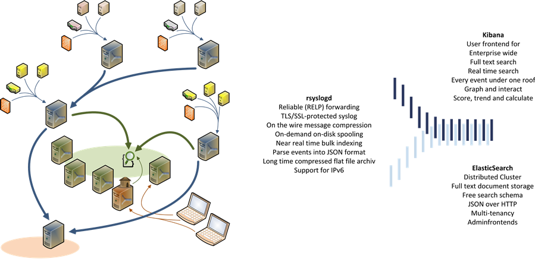

=================
 Welcome to ELMA
=================

The Enterprise Log Management Appliance (ELMA) is a `logging and syslog framework <about.html>`__ complemented by a range of free and open-source tools
that can help you aggregate and deliver metrics, analytics and vital performance data.

**Ship logs from any source**, get the right timestamp, parse and normalize them into structured
JSON format, index them:

|image0|

**All your logs** and other event data from all over your infrastructure **in a central place** -
`Search, graph and analyse <_images/kibana-search.png>`__ them.

Provided as an `preinstalled openSUSE
appliance <http://susestudio.com/a/TOYySW/enterprise-log-management-appliance--2>`__ which can be
`deployed and customized <manuals/installation>`__
in a few minutes ELMA comes out of the box with all necessary services, `fine
customization and performance tuning <manuals/configuration>`__ and allows
easy `adminstration <manuals/administration.html>`__ and `operations <manuals/operation.html>`__.

Issues, problems, enhancements and feature requests are managed with `ELMA project workflow <https://github.com/enterprise-log-management-appliance/elma-doc/issues>`__.
For extended communication please visit `ELMA discussion group <https://groups.google.com/forum/?fromgroups#!forum/enterprise-log-management-appliance>`__.

At the moment we review and completly rewrite our documentation.

`Every feedback and every help is welcome <http://enterprise-log-management-appliance.org/help/contribution>`__.

About - Project overview
========================
.. toctree::
   :maxdepth: 4

   about

2do - Issues, problems, feature requests
========================================
.. toctree::
   :maxdepth: 4

   2do

Manuals
=======
.. toctree::
   :maxdepth: 8

   manuals/index

Performance and compression tests
=================================
.. toctree::
   :maxdepth: 4

   tests/index

Frequently Asked Questions
==========================
.. toctree::
   :maxdepth: 4

   faq/index

Whitepapers
===========
.. toctree::
   :maxdepth: 4

   whitepapers/index

Development
===========
.. toctree::
   :maxdepth: 4

   development/index

