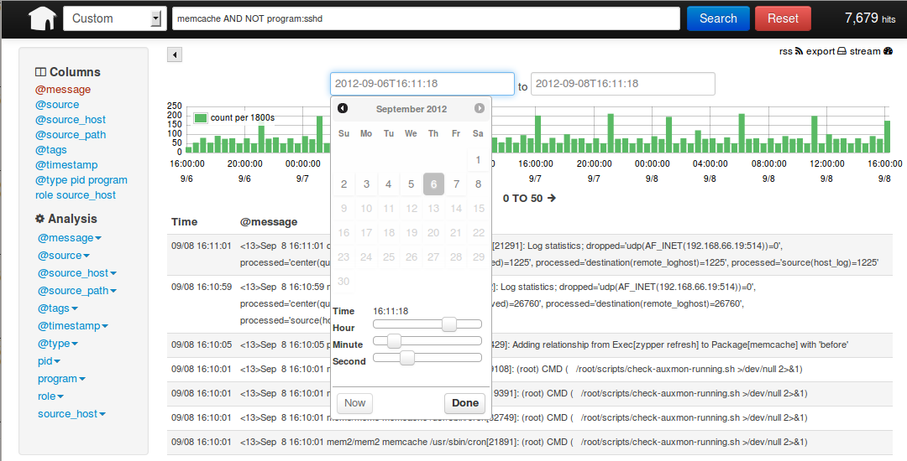

============
 User Guide
============

ELMA is a logging and syslog framework complemented by a range of free
and open-source tools that can help you aggregate and deliver metrics,
analytics and vital performance data.

Log normalization and a web-based query interface makes searching
billions of log events for arbitrary strings as easy as searching the
web.

Supported web browsers
======================

ELMA user and admin interfaces should work in all modern web browsers as
long as they support SVG:

-  Tested with **Firefox > 19.x**.
-  **IE8 & IE9 don't work correctly!**

ELMA user interfaces
====================

Depending on integration into your corporate infrastructure you have to
login with single sign on user credentials provided by your operation or
administration team.

Kibana
------

Point your browser at your local webserver, the one with ELMA and Kibana
already installed. Kibana will auto connect to existing ElasticSearch
cluster.

::

    https://syslog.elma.org

|image0|

Kibana a user friendly way to view, search and visualize your log data.
Click on an event to expand a details pane with all of your fields laid out nicely.

Kibana query syntax
~~~~~~~~~~~~~~~~~~~

Terms
^^^^^

| A query is broken up into terms and operators. There are two types of terms: Single Terms and Phrases.
| A Single Term is a single word such as "test" or "hello".
| A Phrase is a group of words surrounded by **double quotes** such as "hello dolly".

Wildcard Searches
^^^^^^^^^^^^^^^^^

To perform a **single character wildcard** search use the "**?**" symbol.
To perform a multiple character wildcard search use the "*" symbol.

Boolean operators
^^^^^^^^^^^^^^^^^

Boolean operators allow terms to be combined through logic operators to form a more complex query.
**AND**, "**+**", **OR**, **NOT** and "**-**" are supported.

"-" excludes documents that contain the term after. "+" requires that
the term after exist somewhere in a the field of a single document.

Grouping
^^^^^^^^

**Round brackets** let us group terms, **double quotes** group terms into whole
phrases.

Some useful query examples:
^^^^^^^^^^^^^^^^^^^^^^^^^^^

::

    4.3.2.1 AND 1.2.3.4
    4.3.2.1 AND NOT 1.2.3.4
    (4.3.2.1 AND 443) OR (1.2.3.4 AND 80) AND "Deny tcp"
    @source_host:"s2811.nms.bdc-services.net"
    @source_host:m* OR @source_host:s*
    1.1.1.*
    1.1.1.??
    *kibana.org*

**Important:**

-  **Boolean operators** such as AND and/or OR must be **ALL CAPITALIZED**.
-  **Not** use a **``*``** or **``?``** symbol **as the first character of a search**.
-  **Special characters ``+ - && || ! ( ) { } [ ] ^ " ~ * ? : \``** has to be **escaped by \\** using the **\\**.

Learn lots more about `Lucene query
syntax <https://lucene.apache.org/core/old_versioned_docs/versions/3_5_0/queryparsersyntax.html>`__
at the `Apache Lucene <https://lucene.apache.org>`__ and `Kibana
documentation <http://www.elasticsearch.org/guide/en/kibana/current/index.html>`__.

